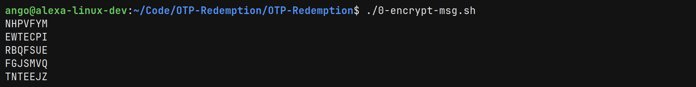
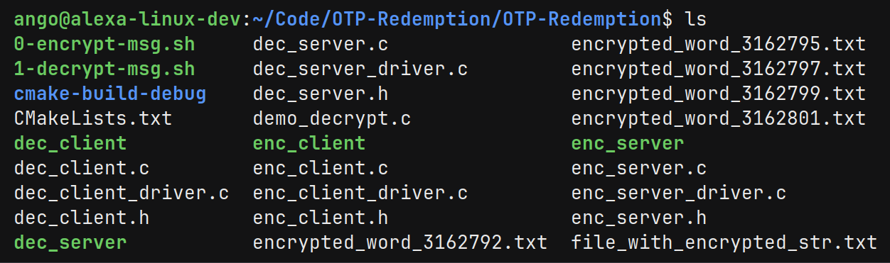
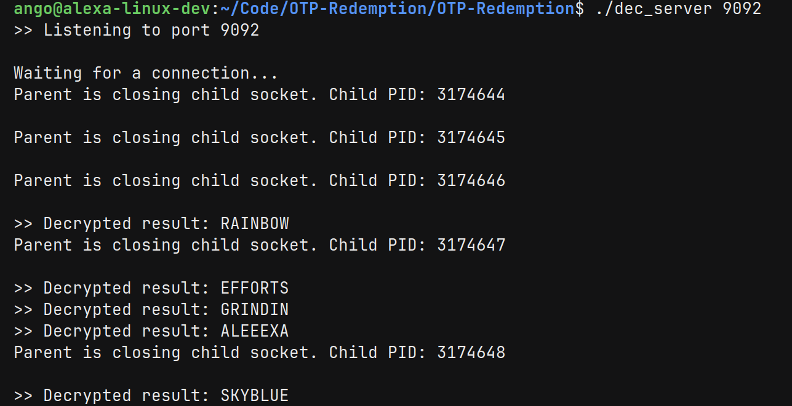

# One-Time Pad (OTP) Encryption Project

This One Time Password (OTP) project implements a simple **client-server** architecture used for encrypting and decrypting a message. We are able to make many client requests to encrypt and decrypt. This project is written in C.

## Overview
This project consists the following 6 programs:
1. `keygen` - Generates a random encryption key
2. `enc_client` - Sends a string to the encryption server
3. `enc_server` - Encrypts a string received from clients
4. `dec_client` - Sends an encrypted file to the decryption server
5. `dec_server` - Decrypts a message received from clients
6. `run_four_child` - Bash script to run 4 client requests to decrypt

## How It Works
1. **Key Generation**: Create a key of length using the keygen program
2. **Encryption**:
    - Client sends: `#keylen#key#msglen#msg` to `enc_server`
    - Server outputs encrypted data to a file (e.g., `encrypted.txt`)
3. **Decryption**:
    - Client sends: a string to the `dec_server` to decrypt
    - Server decrypts the received string from the client and returns the original plaintext
4. **Bash Script**
    - Run four process to simulate four different decryption requests

## Requirements
- **Input**: Messages must be uppercase and space-free
- **Key File**: Single-line uppercase key (e.g., `NMLRBBM`)
- **Ports**: Use distinct ports for encryption/decryption (e.g., `30000`, `30001`)
- **Bad Characters**: There are bad characters not accepted such as `$*!(#*djs8301` 
- **Tools**: `gcc`, `make`.

## Architecture
| Component                 | File(s)             | Description                                                                                                       |
|---------------------------|---------------------|-------------------------------------------------------------------------------------------------------------------|
| **Key Generator**         | `keygen.c`          | Generates a pseudo‑random key of user‑specified length.                                                           |
| **Encryption Client**     | `enc_client.c`      | Builds the request string (`#len#key#len#message`), sends it to the server                                        |
| **Encryption Server**     | `enc_server.c`      | Listens on a TCP port, receives a request string, encrypts the payload, and writes the ciphertext to a file       |
| **Decryption Server**     | `dec_server.c`      | Listen on a TCP port that is different from the enc_server                                                        |
| **Decryption Client**     | `dec_client.c`      | Reads the ciphertext file, sends the key and file name to the decryption server, and outputs the decrypted string |
| **Decrypt Four Requests** | `run_four_child.sh` | Bash script to decrypt four different requests                                                                    |
 
**Note**: All components are compiled separately

## Program Details

### Key Generator (keygen)
- First, generate a key based on the integer of characters we want the key to be.
The generated key is redirected out to be used by the encryption server

```
# Usage: 
$ ./keygen key_length > key.txt

$ ./keygen 7 > key.txt  # Outputs: NMLRBBM
```

### Encryption Server (enc_server)
- We first start the encryption server. The encryption server parses the string containing both the key and message
  to create an encrypted string as an output file in the current directory.

```
# Usage: 
$ ./enc_server port_num_1

$ ./enc_server 30000     # Listen on port 30000
```

### Encryption Client (enc_client)
As an example, if we are encrypting the string `HITHERE`, the encryption client would create the string `#7#NMLRBBM#7#HITHERE` to send to the encryption server to encrypt. The first 7 represents the number of characters in the key, and the second 7 represents the number of characters in the message. The encryption server and decryption server parses the string based on the # character as a delimiter.

The encrypted message is redirected out as a string into a file to the current directory.

```
# Usage: 
$ ./enc_client my_message_to_encrypt key_file_name port > my_encrypted_message

$ ./enc_client my_hi_there_msg key.txt 30000 > my_encrypted_message
```

### Decryption Server (dec_server) 
We start up the decryption server to wait for the decryption client to send us a string.

```
# Usage:
$ ./dec_server port_num_2

$ ./dec_server 30002
```

### Decryption Client (dec_client)
We would then use the decryption client to read the file containing the
encrypted string, and the file containing the key to decrypt the message. Again, the
decryption client would make a string with the encrypted string and key to send to the 
decryption server to decrypt.

```
# Usage:
$ ./dec_client <message_to_decrypt> <key> <port_num_2>

$ ./dec_client my_encrypted_messsage key.txt 30002
```
These programs do not have any memory issues.

## To Run this Program You'll Need:
- message to encrypt: a string in all uppercase letters without any spaces to encrypt and decrypt
- key file: one string that is used as both the encryption and decryption key
- four terminals: have a terminal server as an encryption client, encryption server, decryption client, and decryption server

# Full Workflow Example
```
# Step 1: Generate key
./keygen 7 > key.txt

# Step 2: Start encryption server
./enc_server 30000

# Step 3: Encrypt message
./enc_client "HITHERE" key.txt 30000 > encrypted.txt

# Step 4: Start decryption server
./dec_server 30001

# Step 5: Decrypt
./dec_client encrypted.txt key.txt 30001  # Outputs: HITHERE
```

# Running Concurrent Encryption Requests

We use Bash scripting to run multiple encryption and decryption requests.

## Bash Scripting
1. Create the encrypted string which is stored in a file (encrypted_word_pid_num.txt)



```
$ ./0-encrypt-msg.sh
```

Our directory would look similar to this after the encrypted files are generated:


Next, we decrypt the encrypted string stored in each file. 
```
$ ./1-decrypt-msg.sh
```


# Troubleshooting
- "Port already in use": Try a different port, and both the encryption and
  decryption ports are **different**
- "File not found": Ensure the encrypted file exists in the current directory

Yep, we're able to run multiple concurrent requests.